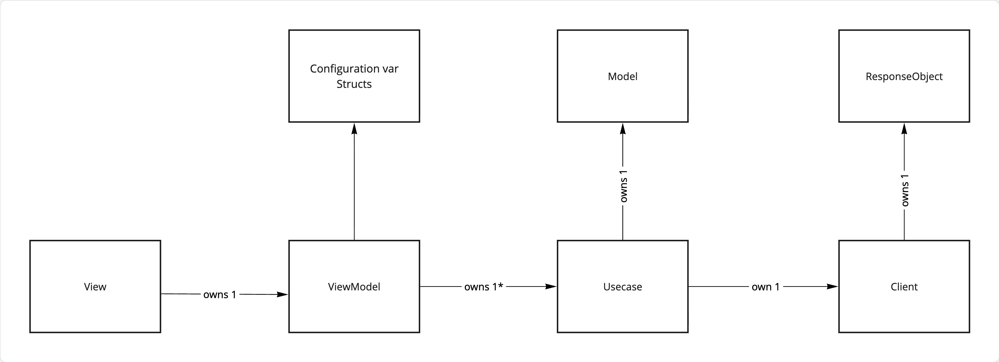
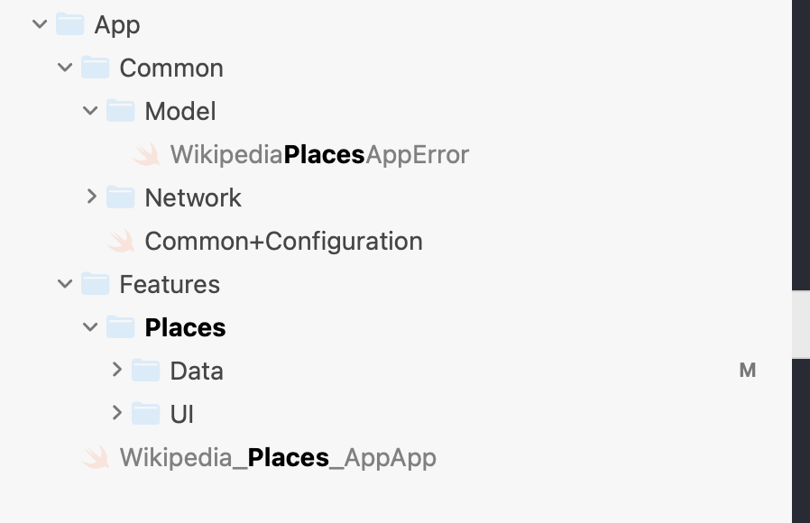
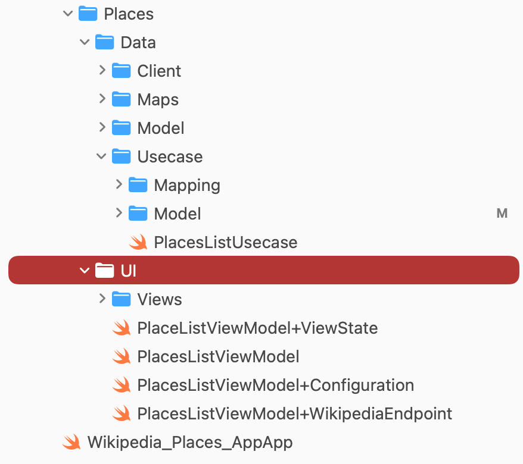

# Places

This app allows users to enter a place and deep-link directly to the Wikipedia app to view more details about that place.

---

# Architecture

This app uses **SwiftUI** with an **MVVM + Use Case** architecture.  

We chose this architecture because it is **simple, scalable, and maintainable**, making it suitable for most moderate sized enterprise applications. It also allows new developers to get up to speed quickly thanks to the clear **folder structure** and consistent **naming conventions**.

---

## Architecture Diagram



---

## Architecture Explanation and Naming Conventions

### View
- Implemented using **SwiftUI**  
- Should **not contain any business logic**  
- Responsible only for rendering the current state of the view  
- Each View has **one ViewModel**

---

### ViewModel
- Contains all logic required to manipulate the view:
  - Form validation  
  - Updating view state
- Introduces a concept called **Configurations**

#### Configuration consists of:
- Colors  
- Constants  
- Localized strings  

Configurations are defined as structs whose values are **not fixed** therefore all properties are declared using **vars**. These values can be modified, especially during testing.  
For example, the app uses a debounce of **500 milliseconds**, which can be set to **0** in tests to make them faster.  

Configurations are usually **injected**, allowing them to be reused across a feature and overridden when needed.  Similar to the use of an **@EnvironmentObject** in **SwiftUI**

A ViewModel can make use of **multiple Use Cases**.

---

### Use Case
In many applications, this layer simply passes data to the ViewModel. In our case, it does more:

- Simplifies the ViewModel implementation  
- Further separates concerns  
- Transforms raw data into entities that can be easily consumed by the View and ViewModel  

A Use Case:
- Owns the model it manipulates  
- Transforms `Codable` structs from the network or other data sources  
- Exposes clean models that require no further manipulation by the View or ViewModel  

---

### Client
- Responsible for making network calls  
- Knows **only** how to fetch data from a given source  

---

## Naming Convention and Folder Structure



The app is divided into two main components:

- `Common`  
- `Features`  

---

## Common

The `Common` module contains shared infrastructure, including:

### RequestManager
- Handles generic encoding and decoding of HTTP requests and responses

### EndpointProtocol
- Enables the creation of structured HTTP `URLRequest`s  
- Makes defining endpoints consistent, reusable and easy

Example:

```swift
func getPlaces() async throws -> PlacesResponse {
    try await manager.perform(
        request: PlacesEndpoint.getPlaces
    )
}
```

### Features

A **Feature** represents a flow within the app, such as making a payment.  
Each feature groups **related screens, entities, and models**.

---

### Folder Structure per Screen in a Feature

We use a **consistent, repeatable folder structure** for every feature and screen.



Each screen contains the following:

---

### Data

This folder contains all logic related to fetching and transforming data.

#### Client
- Responsible for making HTTP requests  

#### Model
- Contains the **Codable** response objects from the network  

#### Use Case
Includes:

- **Mapping**  
  Maps **Codable** HTTP responses into models that can be easily consumed by the `View` and `ViewModel`.

- **Model**  
  Contains models that can be directly used by the `View` and `ViewModel`.

- **Use Case**  
  Uses the `Client` to fetch data from the source and transforms it into a model usable by the `View` and `ViewModel`.

---

### Views

Contains all SwiftUI views required to render the screen, including all localizations.

----

## Tests

This app has `100%` code coverage for the `ViewModel`. and `67%` overral.

We also show case how we test all the mentioned layers of the app.

## Misc

All Classes are `final`

* This app also supports Localization to `Dutch`

* We have added an easy win implicit animations